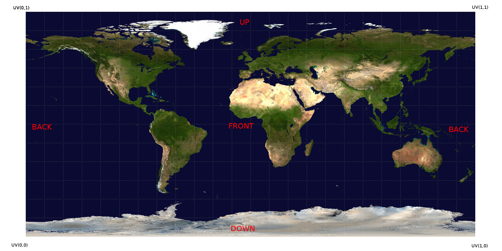

# videojs-vr-retinad
Use the player as you would use [videojs-vr](https://github.com/MetaCDN/videojs-vr). This work aims to be used with a [Retinad](https://www.retinadvr.com "Retinad website") account to collect data. It is [Brightcove Video Cloud](https://www.brightcove.com/en/online-video-platform) compatible.

## How to use

To use the plugin, subscribe to Retinad directly from [our website](https://www.retinadvr.com "Retinad website"). Copy the App ID and Account Key received by email.

## How To Embed into a Page

### Initialising the player and Retinad plugin
```
(function(){
    // Initialise Player
    var player = videojs( '#video-container', {
        techOrder: ['html5']
    });

    // Intialise Retinad Plugin with AppID and AccountKey
    player.retinad({
        "appId": "APP_ID_HERE",
        "accountKey": "ACCOUNT_KEY_HERE"
    });
})();
```

If using [Brightcove Video Cloud](https://www.brightcove.com/en/online-video-platform), add `crossOrigin="anonymous"` in the options of the video tag. For example:

```
<video
id="video-container"
data-video-id="VIDEO_ID_HERE"
data-account="ACCOUNT_HERE"
data-player="default"
data-embed="default"
data-application-id
class="video-js"
crossOrigin="anonymous"
controls></video>
```

## How to contribute

Fork this repository and post a pull request when everything is ready! Don't forget to minify `src/js/videojs.retinad.js` into `dist/`.

### Build
```
npm install
```

### Run
```
npm run serve
```

### Example

Enter the App ID and Account Key in `index.html`. Build and run as explained previously.

## Data format used by Retinad plugin

### Time (Frame number)

The time corresponds to the current playback time of the 360° video. Frames are represented in tenths of seconds. For instance, for a playback time of 1.3 seconds, the frame number will be 13. Hundredths of seconds will be rounded to the nearest tenth of a second. A playback time of 1.25 will have a frame value of 13, while a playback time of 1.21 will have a frame value of 12.


### Camera orientation (UV coordinate)

The orientation of the camera needs to be transposed to a UV format (Mercator Projection). Imagine that your video is in the format of an unwrapped sphere like this world map:



The lower left corner is U = 0 and V = 0. The Upper right corner is U = 1 and V = 1. The front is U = 0.5 and V = 0.5. U is the horizontal component and V the vertical component.

If you need help to convert your camera orientation to our coordinate system, don't hesitate to contact us.

### Context (Video Name)

A context usually corresponds to a video. Its name will usually be the source of the video file.

## TODO

The event handling still needs to be implemented for:

- ~~Pause/Play (send these events to the server and stop the sampling function from collecting data, restart it at Play)~~
- ~~Stop (or when we quit the page to send the remaining data to the server)~~
- Change of display mode (Magic Window, Tap and Scroll, VR)

## Credits

This work is sponsored by [Retinad](https://www.retinadvr.com/).
